<h1 align="center" style="font-size:30px;">
   
  <a href="https://twitter.com/rajchandel/status/1172102870595862528"> Wordy</a>
   
</h1>

<h4 align="center"> Author: <a href="https://twitter.com/rajchandel"> raj chandel</a></h4>

## Nmap

only one port is open so we'll just start enumerating that.

***

## HTTP

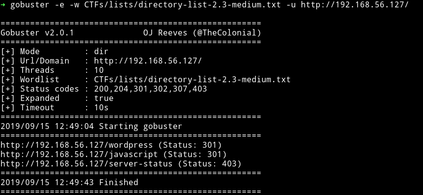

Okay so there is a `wordpress` website there.

Since it's wordpress I ran `wpscan` on it and found 7 vulnerabilities and 2 users.

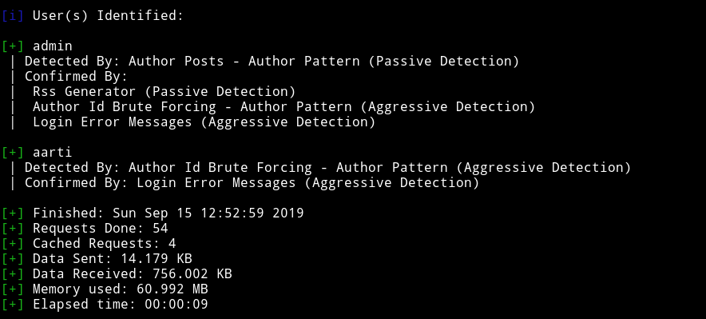

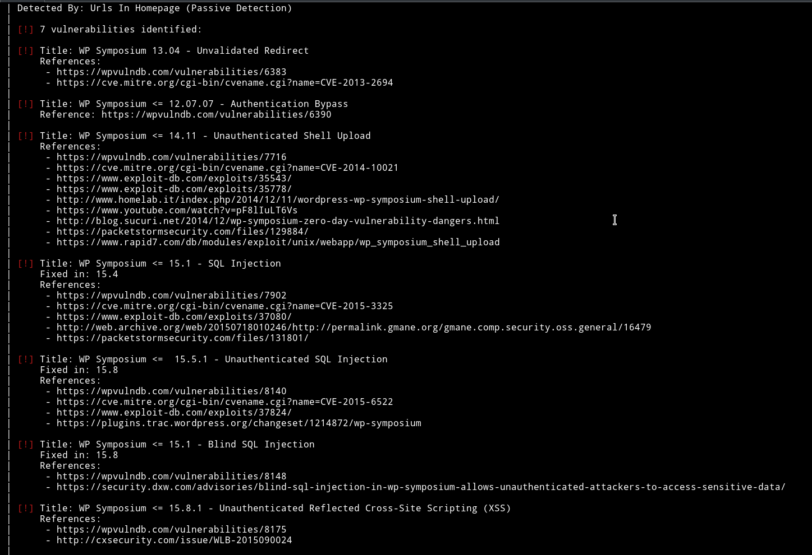

Along with those there were several other vulnerable plugins. I noticed that there was vulnerability in `siteeditor`

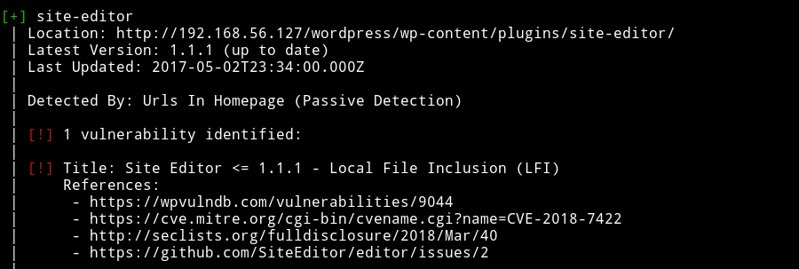

I tested it using the PoC mentioned in [Wordpress Plugin Site Editor 1.1.1 - Local File Inclusion](https://www.exploit-db.com/exploits/44340) on `exploitdb` and it worked.

I tried few things to get RCE via LFI but that didn't worked. Then I decided to go through other vulnerabilities that wpscan found and I noticed that `reflex gallery` had a `arbitary file upload` vuln.

I used metasploit to exploit that vulnerabiltiy and got the shell

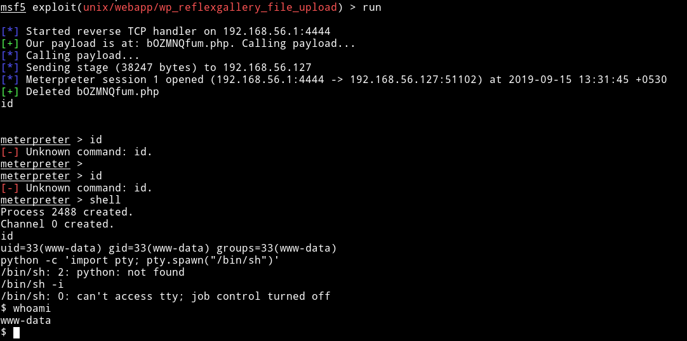

Then I read the `user` flag.

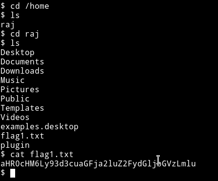

***

## Privilege escalation

I downloaded the `enumeration` script and then ran it to see if I can find something interesting to exploit. To my surprise I found 2 SUID files both of them can be used in some ways to get the root flag.

I used [gtfo](https://github.com/mzfr/gtfo) to search `cp` and `wget` on `gtfbobins.`

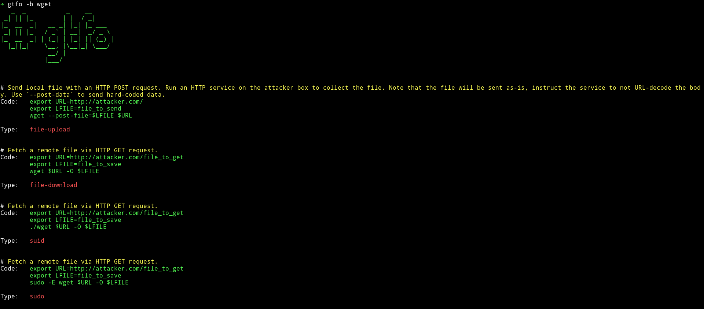

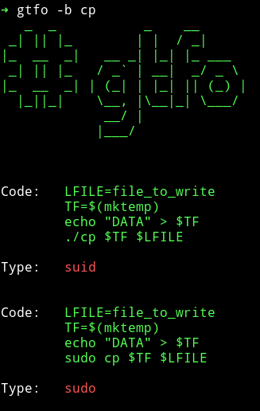

Obviously we can just copy the `flag` from the `/root` directory just to get the flag.

### Method 1

**Getting the root flag**

* `cd /tmp`
* `cp -ir /root .`
    - This will ask you if you want to overwrite the files thus gives you the filename

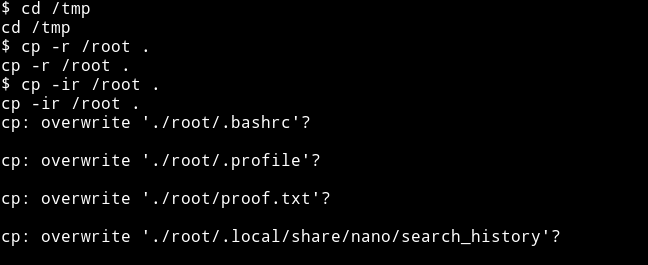

* `cp /root/proof.txt /dev/tty`

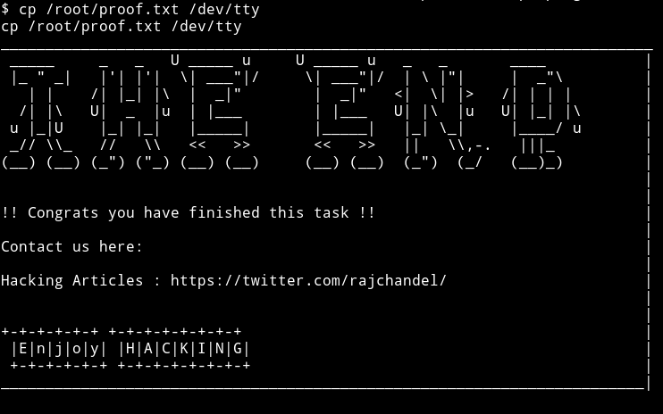

Thanks to [@theart42](https://twitter.com/theart42) for showing me this method.

### Method 2

**Copying and editing a new /etc/passwd**

Since we have `cp` as SUID we can just use that to copy a new `/etc/passwd`.

* `cd /tmp`
* `cat /etc/passwd > passwd`
* `echo "toor:sXuCKi7k3Xh/s:0:0::/root:/bin/bash" >> passwd`
* `cp passwd /etc/passwd`

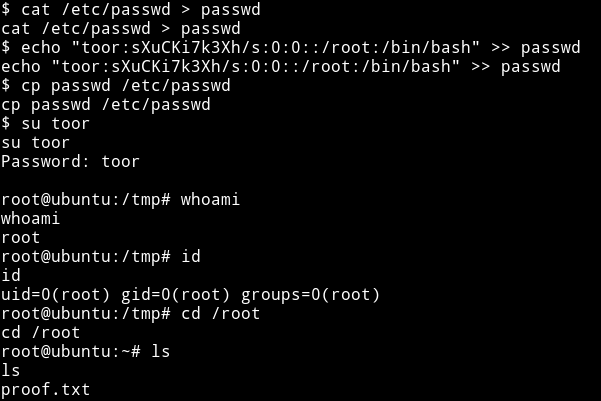

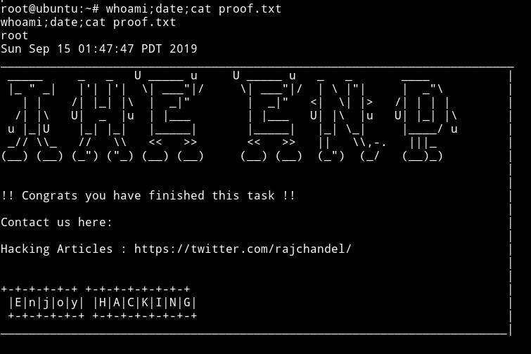

### Method 3

Use [hacking article's](https://www.hackingarticles.in/linux-for-pentester-cp-privilege-escalation/) method which is similar to [Method 2](#method-2).

***

This was a beginner level machine with some really good rabbit holes.

Thanks to [rajchandel]() for making this machine.

***

Thanks for reading, Feedback is always appreciated.

Follow me [@0xmzfr](https://twitter.com/0xmzfr) for more “Writeups”.
